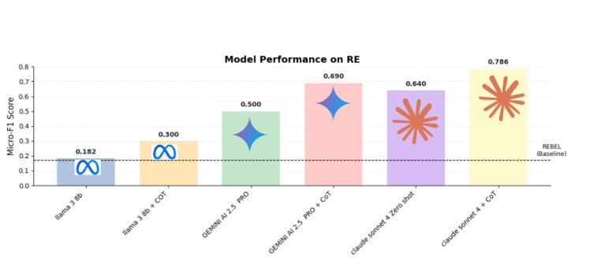

# ARENA-2025: Automated Entity & Relation Extraction for LULC

## 📌 Project Overview
This repository contains research code, datasets, and experiments for **automated extraction of entities and relations** from scientific literature on **Land Use and Land Cover (LULC) change**.  
The project is part of the **ARENA 2025 initiative**, focusing on **Natural Language Processing (NLP)** and **Knowledge Graph construction** to support environmental and climate research.

---

##  Research Goals & Approach

The **main goal** of this project is to **automate the extraction of relations between entities** in LULC-related texts.

We explored two complementary strategies:

### 1. **Pipeline Approach**
- **Entity Extraction**
  - Rule-based: **SpaCy + custom vocabulary**
  - Transformer-based: **fine-tuned RoBERTa model** for improved NER
- **Relation Extraction**
  - Tested multiple models:
    - **Mistral AI**
    - **LLaMA 3 (8B)**
    - **Claude Sonnet (decoder-only) with Chain-of-Thought (CoT) prompting**

### 2. **Joint Entity + Relation Extraction**
- Unified models to simultaneously extract both entities and relations.  
- Evaluated several **decoder-only LLMs** with different prompting strategies:
  - **LLaMA 3 (8B)** and **LLaMA 3 + CoT**
  - **Gemini AI 2.5 Pro** and **Gemini AI 2.5 Pro + CoT**
  - **Claude Sonnet 4 (Zero-shot and CoT prompting)**

 **Results**:  
Claude Sonnet 4 + CoT prompting achieved the **best performance** with a **Micro-F1 score of 0.786**, outperforming other models.

### 3. **Relevant Sentence Extraction**
- To narrow down to sentences that likely contain relations, two approaches were tested:
  - **Sentence Classification**: fine-tuned **BERT model**
  - **Information Retrieval**: embeddings with **all-MiniLM-L6-v2**

---

##  Dataset for Relation Extraction
- **233 queries** were defined to capture possible LULC entity–relation pairs.  
- For each query, we collected **relevant sentences** from scientific papers.  
- Relevant sentences were extracted using both:
  - **BERT classification model**
  - **Embedding-based retrieval (all-MiniLM-L6-v2)**  

This dataset was then used to evaluate both pipeline and joint extraction methods.

---

## 🗂 Repository Structure
ARENA-2025/
│
├── 📂 papers/
│ └── Collection of downloaded scientific articles on LULC change
│ (source material for entity and relation extraction)
│
├── 📂 extracted_text/
│ └── Pre-processed text extracted from the PDF papers
│ (segmented into sentences and paragraphs)
│
├── 📂 data/
│ ├── LULC.csv # Vocabulary of Land Use / Land Cover terms
│ ├── LCprocess.csv # Vocabulary of LULC process/change terms
│ ├── all_segmented_sentences_from_articles.csv
│ │ → Complete sentence segmentation from all papers
│ ├── extracted_lulc_sentences_from_articles_by_BERT.csv
│ │ → Sentences classified as LULC-relevant by the fine-tuned BERT model
│ ├── sentence_extraction_results_IR.csv
│ │ → Relevant sentences retrieved using IR (MiniLM embeddings)
│ ├── paragraph_extraction_results_IR.csv
│ │ → Relevant paragraphs retrieved using IR approach
│ └── Queries.csv # 233 predefined queries for RE evaluation
│
├─├── 📂 Joint Entity/
│ ├── 📂 RESULT/ # Output results from experiments
│ ├── 📂 prompt/ # Prompts used for entity/relation extraction
│
├
│
├─├── 📂 Pipeline Approach/
│ ├── Rule-based: **SpaCy + custom vocabulary notebooks
│ ├── ransformer-based: **fine-tuned RoBERTa model for improved NER** notebooks
│ ├── Relation Extractio notebooks
│
├── README.md # Project overview and documentation
└── requirements.txt # Dependencies for reproducibility
